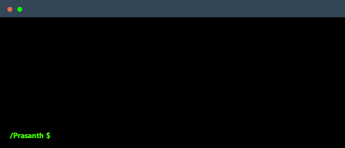

 

Computer Science Undergraduate @ Shiv Nadar University 

- 🌱 Machine Learning And Data Science Enthusiast | AI and IoT Applications
- 🎓 Second-year Engineering Student at 
- 🧠 Passionate About Solving Real-World Problems Using Data
- 📄 Check Out My Resume [Prasanth M](https://drive.google.com/file/d/1b6BnaA7CEQzvvTa1A1KFrKr8MH1C6X7O/view?usp=drive_link)
- 📫 Feel free to ping me on [LinkedIn](https://www.linkedin.com/in/prasanth-data-science)

 
  

<h2 align="center">⚡ My Skills</h2>

    

### I code in
          

### IDE and Tools I Use
     

